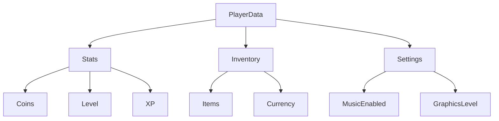
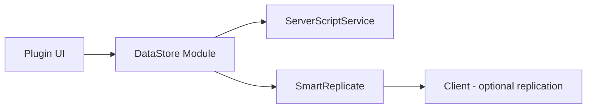
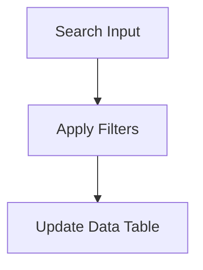

# DataStore Builder & SmartReplicate

**DataStore Builder** is a Roblox Studio plugin that simplifies the
creation and management of structured DataStore modules.\
It provides a visual interface for organizing folders, defining typed
keys, editing values, and exporting modules directly into your
experience.

The plugin integrates with **SmartReplicate**, a secure client-server
replication system that ensures player data is validated, synchronized,
and safely shared when needed.

------------------------------------------------------------------------

## Preview

``{=html}
``{=html}
``{=html}

``{=html}
``{=html}

``{=html}

------------------------------------------------------------------------

# Plugin Overview

DataStore Builder allows developers to manage complex data structures in
Roblox visually.

-   **Folder-based organization** for structured data\
-   **Type safety** to prevent errors\
-   **Instant editing** and updates\
-   **Module generation** and update management\
-   **SmartReplicate integration** for secure data replication

------------------------------------------------------------------------

# Features

  Feature                      Description                             Status
  ---------------------------- --------------------------------------- --------
  Folder-based DataStore       Organize keys in folders                ✅
  Typed Values                 Type-enforced keys for safety           ✅
  Module Generation            Automatic creation/update of modules    ✅
  Search & Filter              Quick search across all data            ✅
  SmartReplicate Integration   Safe client-server replication          ✅
  Middleware Support           Pre-save validation & transformations   ✅

------------------------------------------------------------------------

# Quick Start

1.  Install DataStore Builder plugin.\
2.  Open the plugin from the toolbar.\
3.  Create folder structure and define keys.\
4.  Save the DataStore modules.\
5.  Place SmartReplicate module in ServerScriptService.\
6.  Start the game; data will replicate securely.

------------------------------------------------------------------------

# Search Syntax

Use the search panel to filter your data quickly:

-   `folder:<name>` → search within a folder\
-   `key:<name>` → search by key\
-   `type:<type>` → filter by type (string, number, boolean, table)\
-   `value:<value>` → exact value match\
-   `min:<number>` / `max:<number>` → numerical range\
-   `!<key>` → exclude a key from search

------------------------------------------------------------------------

# Data Structure Example

``` text
PlayerData
├─ Stats
│  ├─ Coins (number)
│  ├─ Level (number)
│  └─ XP (number)
├─ Inventory
│  ├─ Items (table)
│  └─ Currency (number)
└─ Settings
   ├─ MusicEnabled (boolean)
   └─ GraphicsLevel (number)
```

### Mermaid Diagram Example



------------------------------------------------------------------------

# Plugin Architecture



This diagram shows how the plugin, module, server, and client interact.



```mermaid
flowchart LR
  DataTable["Data Table"] --> EditUI["Value Editor"]
  EditUI --> Update["Update DataStore Module"]
  Update --> Middleware["Run Middleware"]
  Middleware --> SmartReplicate["SmartReplicate"]
  ```

------------------------------------------------------------------------

# SmartReplicate Module

SmartReplicate is a Roblox Lua module designed to safely replicate
player data between the server and clients. It validates data, enforces
types, triggers events, and ensures safe public/private replication.

### Workflow

1.  **Setup**: Place the module in `ServerScriptService`.\
2.  **Create Player Folders**: Each player receives a `PlayerFolder`
    with default schema.\
3.  **Define Data**: Use `Define` to add items with type, default value,
    and replication mode.\
4.  **Listen for Changes**: Attach listeners to individual items or
    folders.\
5.  **Middleware**: Validate, transform, or enforce rules before
    saving.\
6.  **Update Data**: Call `Update` to change values; middleware and
    replication rules apply.\
7.  **Replication Modes**: Public = all clients, Private = only owner.\
8.  **Cleanup**: Folders are removed when players leave; events notify
    clients.

SmartReplicate abstracts the networking complexity for safe and reliable
multiplayer data handling.

------------------------------------------------------------------------

# Screenshots

### Plugin Icon


### Interface


### Folder Editor


### Data Editing Panel


### Toolbar


### Data Overview


------------------------------------------------------------------------

# Plugin Store

[Roblox Plugin Store
Link](https://create.roblox.com/store/asset/106198281373990/DataStoreService)

------------------------------------------------------------------------

# Support

For errors, feedback, or feature suggestions, join the Discord server:\
[Discord Invite](https://discord.gg/xtEMCYmuKk)
